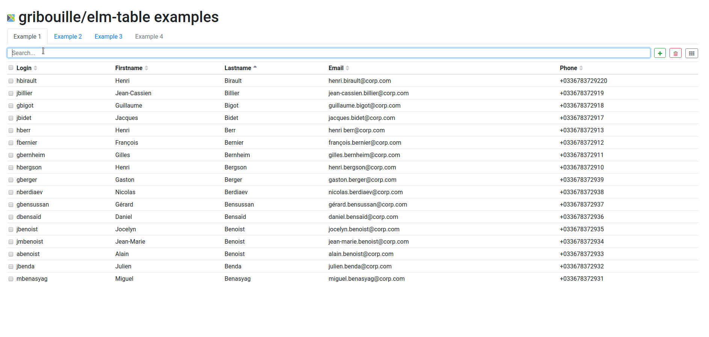
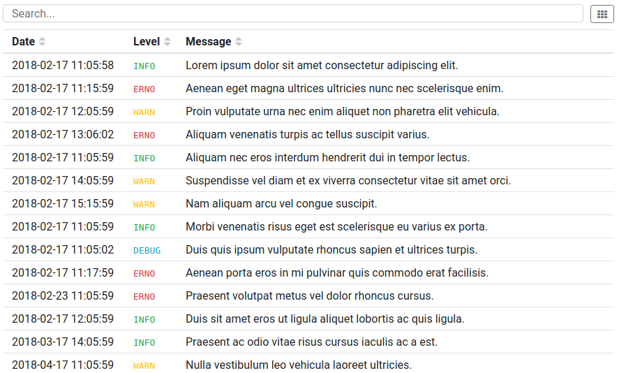

# elm-table
ELM Bootstrap 4 table ready to use  ([live demo](https://gribouille.github.io/demos/elm-table/1.0.0)).

<p align="center"></p>

Features:
- rows filtering
- rows selection
- toolbar
- columns sorting
- custom cells and colums rendering

<p align="center"></p>


Inspired from:  
- [elm-sortable-table](https://github.com/evancz/elm-sortable-table) 
- [Boostrap Table](http://bootstrap-table.wenzhixin.net.cn/).


## Usage

Install bootstrap:
```
npm install --save bootstrap@">=4.0.0"
```

Install the ELM package:
```
elm-package install gribouille/elm-table
```

Include the [styles](./styles/table.scss) in your projects.


## Example

To start the examples in dev mode:
```
cd examples
npm install
npm run dev
```

Open [http://localhost:8080](http://localhost:8080).

To build the examples:
```
npm run dist
```

## Documentation

See the documentation [here](http://package.elm-lang.org/packages/gribouille/elm-table/latest).

## TODO

- [ ] pagination
- [ ] ajax loading
- [ ] rewrite examples/webpack.config.js
- [ ] rewrite ELM module documentation


## Contributing

Feedback and contributions are very welcome.


## License

This project is licensed under [Mozilla Public License Version 2.0](./LICENSE).